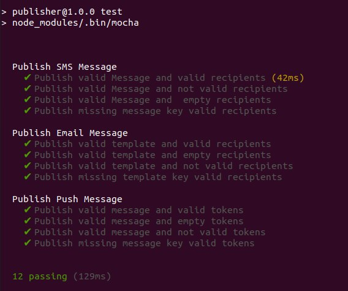

#How to run?

- step *(1) make sure to be inside the root directory `notify-nodejs` then run 
```
docker-compose up -d
```
- and when you want to shutdown run
```
docker-compose down
```


# Testing

- make sure that you have successfully run step (1) 
- navigate to this path in the terminal
```
cd publisher
```
- run 
``` 
  npm i 
```
- run the test with this command
```
npm test
```
- you should see somthing like this:
  


# API Calling

- send SMS notifications
```
curl --location --request POST 'http://localhost:3000/sms' \
 --header 'Content-Type: application/json' \
 --data-raw '{
     "message": "the transfer has been submitted",
    "recipients": [
        "01006736720"
    ]
}'
```
- send Email notifications
```
curl --location --request POST 'http://localhost:3000/email' \
--header 'Content-Type: application/json' \
--data-raw '{
    "template": "the transfer has been submitted",
    "recipients": [
        "a.galal.atia@gmail.com"
    ]
}'
```
- send Push notifications
```
curl --location --request POST 'http://localhost:3000/pushh' \
--header 'Content-Type: application/json' \
--data-raw '{
    "message": "the transfer has been submitted",
    "tokens": [
        "iopjiou89sda7f8das7fj23oi4u923jl"
    ]
}'
```
